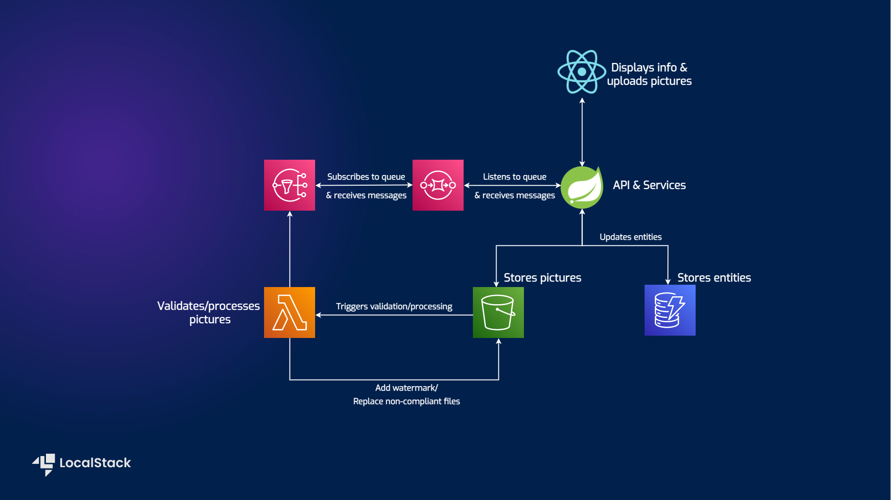

# Shipment List Demo Application - Using Terraform with Testcontainers


| Environment      |   |
|------------------|--------------------------------------------------------------------------------------------------------------------------------------------------------------------------------------------------------------------------------------------------------------------------------------------------------------------------------------------------------------------------------------------------------------------------------------------------------------------------------------------------------------------------------------------------------------------------------------------------------------------------------------------------------------------------------------------------------------------------------------------------------------------------------------------------------------------------------------------------------------------------------------------------------------------------------------------------------------------------------------------------------------------------------------------------------------------------------------------------------------------------------------------------------------------------------------------------------------------------------------------------------------------------------------------------------------------------------------------------------------------------------|
| __Services__     | Amazon S3, Lambda, DynamoDB, SNS, SQS                                                                                                                                                                                                                                                                                                                                                                                                                                                                                                                                                                                                                                                                                                                                                                                                                                                                                                                                                                                                                                                                                                                                                                                                                                                                                                                                          |
| __Integrations__ | AWS SDK, Terraform                                                                                                                                                                                                                                                                                                                                                                                                                                                                                                                                                                                                                                                                                                                                                                                                                                                                                                                                                                                                                                                                                                                                                                                                                                                                                                                                                |
| __Categories__   | Spring Boot, S3 Trigger                                                                                                                                                                                                                                                                                                                                                                                                                                                                                                                                                                                                                                                                                                                                                                                                                                                                                                                                                                                                                                                                                                                                                                                                                                                                                                                                                        |
| __Level__        | Intermediate                                                                                                                                                                                                                                                                                                                                                                                                                                                                                                                                                                                                                                                                                                                                                                                                                                                                                                                                                                                                                                                                                                                                                                                                                                                                                                                                                                   |
| __Works on__     | LocalStack v3                                                                                                                                                                                                                                                                                                                                                                                                                                                                                                                                                                                                                                                                                                                                                                                                                                                                                                                                                                                                                                                                                                                                                                                                                                                                                                                                                                  |


### UPDATE

The Terraform configuration file now randomly generates names for the bucket, in order to avoid conflicts
at a global scale on AWS. This name shall be written out to a properties file, which the app will pick up
and use for the S3 client. Furthermore, the name is also passed as an environment variable to the Lambda function by Terraform,
so there's no need to worry about managing it.


## Introduction

The purpose of this demo is to highlight the ease of integrating LocalStack with Testcontainers and using Terraform to provision
the necessary test infrastructure. The original demo: https://github.com/localstack-samples/sample-shipment-list-demo-lambda-dynamodb-s3.

## Architecture Overview



## Prerequisites for tests only

- [Maven 3.8.5](https://maven.apache.org/install.html) & [Java 17](https://www.java.com/en/download/help/download_options.html)
- [Docker](https://docs.docker.com/get-docker/) - for running LocalStack

#### Application description

*shipment-list-demo* is a Spring Boot application dealing with CRUD operations a person can
execute on a bunch of shipments that they're allowed to view - think of it like the Post app.
The demo consists of a backend and a frontend implementation, using React to display the
information.
The AWS services involved are:

- [S3](https://docs.localstack.cloud/user-guide/aws/s3/) for storing pictures
- [DynamoDB](https://docs.localstack.cloud/user-guide/aws/dynamodb/) for the entities
- [Lambda](https://docs.localstack.cloud/user-guide/aws/lambda/) function that will validate the pictures, apply a watermark and replace non-compliant files.
- [SNS](https://docs.localstack.cloud/user-guide/aws/sns/) that receives update notifications
- [SQS](https://docs.localstack.cloud/user-guide/aws/sqs/) that subscribes to a topic and delivers the messages to the Spring Boot app


### Running tests

There are several tests available, testing different scenarios, to assure good integration between services.
Ideally we want to focus on the workflows and make sure they run correctly:


### Terraform configuration files as init hooks

Since the main infrastructure provisioning tool is Terraform, it would only be natural to use the same file to create resources
for testing purposes. This insures the environment is set up as expected and there are no discrepancies between what we test and
what we expect to see in production.

## Instructions

### Building the validator module

Step into the `shipment-picture-lambda-validator` module and run `mvn clean package shade:shade`.
This will create an uber-jar by packaging all its dependencies. We'll need this to pass to the container to build the Lambda
function.

### Using Testcontainers

LocalStack is now supporting Terraform config files to be used as [init hooks](https://docs.localstack.cloud/references/init-hooks/).
This means that the container will automatically recognize and run the `main.tf` file placed in the `ready.d` folder.

```java
    @Container
    protected static LocalStackContainer localStack =
            new LocalStackContainer(DockerImageName.parse("localstack/localstack-pro:latest"))
                    .withEnv("LAMBDA_REMOVE_CONTAINERS", "1")
                    .withEnv("EXTENSION_AUTO_INSTALL", "localstack-extension-terraform-init")
                    .withEnv("LOCALSTACK_AUTH_TOKEN", System.getenv("LOCALSTACK_AUTH_TOKEN"))
                    .withFileSystemBind("./lambda/shipment-picture-lambda-validator.jar",
                            "/etc/localstack/init/ready.d/lambda/shipment-picture-lambda-validator.jar")
                    .withFileSystemBind("./terraform",
                            "/etc/localstack/init/ready.d")
                    .withStartupTimeout(Duration.of(4, ChronoUnit.MINUTES))
                    .withEnv("DEBUG", "1");
```

We pass the contents of the `terraform` directory to the container, as it needs more than just a singular TF file.
By mounting the entire folder, we can run the tests multiple times without having to download the AWS provider every time on the `init` operation.


## Running the tests

You can simply run the following command in the root folder.

```bash
LOCALSTACK_AUTH_TOKEN=<your_auth_token> mvn -Dtest=ShipmentServiceIntegrationTest test
```

Additionally, you can also use your IDE (such as IntelliJ IDEA) to have a better interface of running your tests.


## Contributing

We appreciate your interest in contributing to our project and are always looking for new ways to improve the developer experience. We welcome feedback, bug reports, and even feature ideas from the community.
Please refer to the [contributing file](CONTRIBUTING.md) for more details on how to get started.


